# How to Make a Website

#### By Larry K.

- [Objective](#objective)  
- [Discusson: How The Internet Works](#discussion)  
- [Making a Web Page](#making)  
  - [Step 1: The basics - ```<html>```, ```<head>```, ```<title>```, and ```<body>``` tags](#step1)  
  - [Step 2: Adding headings ```<h1>```, paragraphs ```<p>```, bold ```<b>```, and italic ```<i>```](#step2)  
  - [Step 3: Ordered ```<ol>``` and Unordered Lists ```<ul>``` and List Items ```<li>```](#step3)
  - [Step 4: Adding Links with the ```<a>``` tag](#step4)  
  - [Step 5: Publishing Your Web Page](#step5)  
- [Going Further](#goingfurther)
  - [Images](#images)  
  - [Videos](#videos)  
  - [Quotations](#quotations)  
  - [Tables](#tables)  
  - [Forms](#forms)
  - [JavaScript](#javascript)  

<a name="objective" />

## Objective

Students will be able to create a web page to express themselves. They will be able to explain how the Internet, HTTP, HTML, and web browsers work at a basic level. They will leave class with a published web page with links to their class projects and interests.

<a name="discussion" />

## Discussion: How The Internet Works

What is a web page and how do you make one? A web page is a document written in **HTML** (Hypertext Markup Language) that is **accessible on the internet** using a **web browser**.

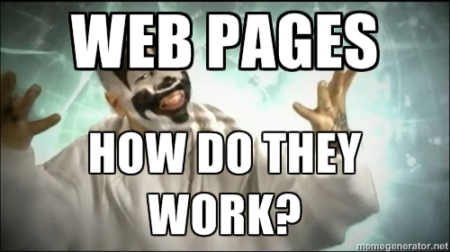

### HTML

HTML is a markup language used for creating web pages. An HTML page consists of a set of HTML _elements_ or markup _tags_ that specify the appearance or presentation of a document.

Below is a very basic example of a web page. The first and last elements of this web page are the opening ```<html>``` and closing ```</html>``` tags, which specify that this is an HTML document. ```Nested``` within the ```<html>``` tags are other HTML tags that divide the page into the ```<head>``` and ```<body>``` sections. In the ```<head>``` section you put webpage metadata (data about the web page) such as the web page's title. In the ```<body>``` section you put the web page's content, which is visible in the web browser:

```
<html>
    <head>
        <title>My Web Page</title>
    </head>
    <body>
        Hello web page!
    </body>
</html>
```

You can go to any website and click _"View Source"_ in your browser to see the markup that makes up that web page. If you like how a particular website looks and want to study how it works, you can copy its source code to a file and modify it for learning purposes. However, do not plagiarize the design or full markup of someone else's work. Another way to study a web page's markup is to install Mozilla Goggles - https://goggles.mozilla.org/.

### The Internet


#### IP Addresses

The Internet consists of networked computers talking to each other. Each computer has an IP address, which is a unique numerical address for each computer on the Internet. You can think of it like a phone number - if you want to call one of your friends, their phone number uniquely identifies their phone. An IP address (eg. 121.13.44.234) uniquely identifies a computer on the Internet.

#### DNS and Domain Names

The Domain Name System, or DNS, translates a domain name (eg. google.com) to an IP address. This is useful for a couple of reasons. First, it is much easier to type in a domain name. Secondly, IP addresses can change - for instance, what if you are working on your laptop at home, then go connect to WiFi at a coffee shop? Your IP address will certainly change because you are connecting to a different router and network. Web servers typically have a domain name that maps to the web server's IP address, that way when you type "google.com" in your web browser, the request will be routed to the necessary web server without knowing its underlying IP address. Going back to our phone number metaphor - do you still dial people's phone numbers when you want to call someone? No, you probably make it easier by making a "Contact" and just pressing the person's name. Then your phone dials the phone number associated with that Contact so you don't have to remember it. When someone's phone number changes, you update the Contact.

#### HTTP

HTTP is a protocol that defines how a web browser (or other client) requests resources from a web server. For instance, you might use Google Chrome to request a specific web page, and a web server would respond with all of the HTML, images, videos, and other resources necessary to render that web page. The browser (or client) and the web server communicate using HTTP messages.

#### Web Browser

A web browser runs on the client machine. It can communicate via HTTP with a web  server by sending an **HTTP Request**. The web server parses this request and returns a **HTTP Response**. To extend our phone number metaphor, think of two people texting each other, one person is the client and one person is the server. You could send them a request "Where are we meeting up?" and get a response "In the commons". Their response is rendered on your phone. Web browsers send a special request message to retrieve a web page. That message goes to a server, which responds with the appropriate HTML. That HTML is rendered back in your web browser.

#### Web Server

A web server responds to the client's requests for resources. When you type in a URL, it runs any necessary programs and scripts (eg. Python, Ruby, PHP) associated with that URL and returns the necessary response to the client.

<a name="making" />

## Making a Web Page using HTML in 5 Steps

<a name="step1" />

### Step 1: The basics - ```<html>```, ```<head>```, ```<title>```, and ```<body>``` tags

You should have already completed this step in the warmup. Everyone should be able to open their file in a web browser and see a simple web page. We already discussed the most basic elements of an HTML page, so you should already have some understanding of these elements.

#### HTML

```
<html>
    <head>
        <title>My Web Page</title>
    </head>
    <body>
        Hello web page!
    </body>
</html>
```

#### What it Looks Like

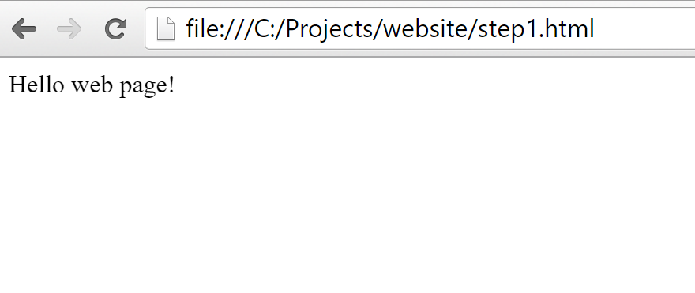

<a name="step2" />

### Step 2: Adding headings `<h1>`, paragraphs `<p>`, bold `<b>`, and italic `<i>`

Text in a web page can be formatted using HTML tags. You can make headings and subheadings for sections of your web page using the `<h1>` and `<h2>` tags. You can start a new paragraph by using the `<p>` tag. You can **bold** text by using the `<b>` tag and *italicize* text by using the `<i>` tag. All tags must have an opening `<b>` and closing `</b>` tag around the text it is formatting.

Let's get specific. Replace the "Hello web page!" text above with some unique text to make this web page your own. Copy and paste the following HTML code between the `<body>` tags:

```
<h1>My Intro to CS Web Page</h1>

<p>Hello, welcome to <b>my web page</b>!</p>

<h2>Top 5</h2>

<p>Here are my top 5 favorite albums:</p>

<h2>Portfolio</h2>

<p>Here are some links to <i>projects</i> I have made:</p>
```

Once you are done, your HTML should look like this:

#### HTML

```
<html>
<head>
    <title>My Web Page</title>
</head>
<body>
    <h1>My Intro to CS Web Page</h1>

    <p>Hello, welcome to <b>my web page</b>!</p>

    <h2>Top 5</h2>

    <p>Here are my top 5 favorite albums:</p>

    <h2>Portfolio</h2>

    <p>Here are some links to <i>projects</i> I have made:</p>
</body>
</html>
```

#### What it Looks Like

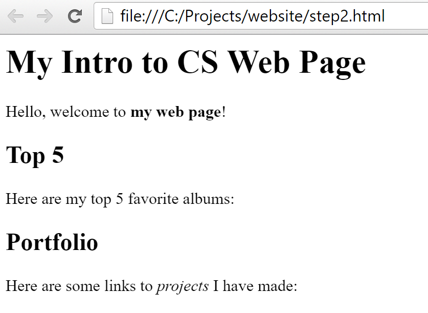

<a name="step3" />

### Step 3: Ordered ```<ol>``` and Unordered Lists ```<ul>``` and List Items ```<li>```

We are going to add some lists to our web page. You can create numbered or "ordered" lists by using the `<ol>` tag. In an HTML list, each item in a list is  enclosed in ```<li>``` tags. Ordered lists have a number next to each list item, indicating its position in the list. Below is a list of my top 5 favorite albums. Modify the list to include your own top 5 of anything - it may be a list of actors, books, movies, classes, or people you can't stand.

### Ordered List

```
<h3>My 5 Favorite Albums</h3>

<ol>
    <li>Tool - Aenima</li>
    <li>Portishead - Dummy</li>
    <li>Outkast - Aquemini</li>
    <li>At the Drive-In - Relationship of Command</li>
    <li>Deftones - Adrenaline</li>
</ol>
```

### Unordered List

Unordered lists are created by using the `<ul>` tag. In an unordered list, there are no numbers next to each list item. It is just a plain bulleted list. Below I am making a list of Snap! projects I have completed.

```
<h3>My Intro to CS Portfolio</h3>

<ul>
    <li>Pong</li>
    <li>Hello Kitty</li>
    <li>Nursery Rhyme</li>
</ul>
```

#### HTML

```
<html>
<head>
    <title>My Web Page</title>
</head>
<body>
    <h1>My Intro to CS Web Page</h1>

    <p>Hello, welcome to <b>my web page</b>!</p>

    <h2>Top 5</h2>

    <p>Here are my top 5 favorite albums:</p>

    <ol>
        <li>Outkast - Aquemini</li>
        <li>Tool - Aenima</li>
        <li>Portishead - Dummy</li>
        <li>At the Drive-In - Relationship of Command</li>
        <li>Deftones - Adrenaline</li>
    </ol>

    <h2>Portfolio</h2>

    <p>Here are some links to <i>projects</i> I have made:</p>

    <ul>
        <li>Pong</li>
        <li>Hello Kitty</li>
        <li>Nursery Rhyme</li>
    </ul>
</body>
</html>
```

#### What it Looks Like

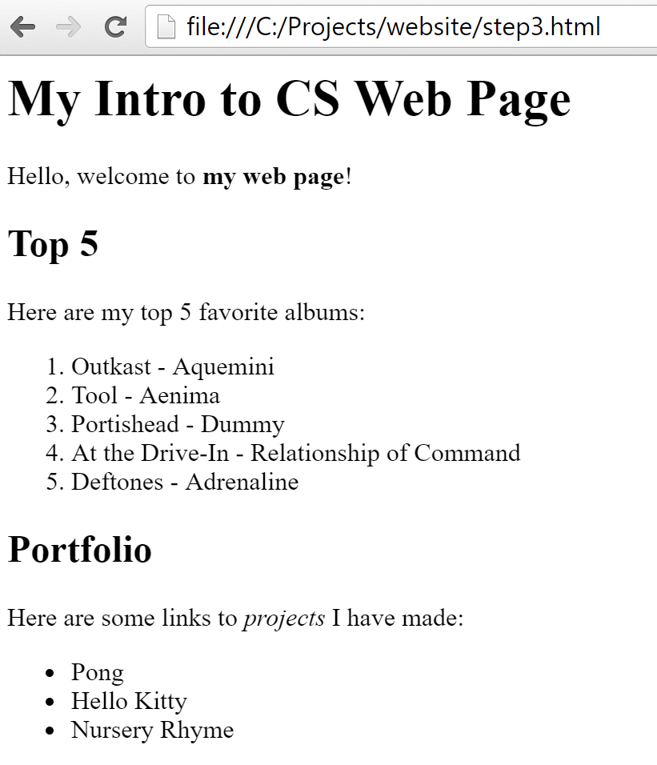

<a name="step4" />

### Step 4: Adding Links with the `<a>` tag

Web pages are connected together with links. Links are created using the `<a>` tag. The `<a>` tag requires an HTML `attribute` that defines what page it is **_linking to_**. For the `<a>` tag, you specify the URL it is linking to with  `href=` and the URL that you are linking to. For example `<a href="http://google.com">Google</a>` links to Google.com. Below I have added links to my list of Snap projects so that other people can view them:

```
<h3>My Intro to CS Portfolio</h3>

<ul>
    <li><a href="http://snap.berkeley.edu/snapsource/snap.html#present:Username=larrykubin&ProjectName=pong">Pong</a></li>
    <li><a href="http://snap.berkeley.edu/snapsource/snap.html#present:Username=larrykubin&ProjectName=kitty">Hello Kitty</a></li>
    <li><a href="http://snap.berkeley.edu/snapsource/snap.html#present:Username=larrykubin&ProjectName=nursery">Nursery Rhyme</a></li>
</ul>
```
#### Output

* [Pong Project](http://snap.berkeley.edu/snapsource/snap.html#present:Username=larrykubin&ProjectName=pong)
* [Hello Kitty Project](http://snap.berkeley.edu/snapsource/snap.html#present:Username=larrykubin&ProjectName=kitty)
* [Nursery Rhyme Project](http://snap.berkeley.edu/snapsource/snap.html#present:Username=larrykubin&ProjectName=nursery)

#### Final HTML Markup

```
<html>
<head>
    <title>My Web Page</title>
</head>
<body>
    <h1>My Intro to CS Web Page</h1>

    <p>Hello, welcome to <b>my web page</b>!</p>

    <h2>Top 5</h2>

    <p>Here are my top 5 favorite albums:</p>

    <ol>
        <li>Outkast - Aquemini</li>
        <li>Tool - Aenima</li>
        <li>Portishead - Dummy</li>
        <li>At the Drive-In - Relationship of Command</li>
        <li>Deftones - Adrenaline</li>
    </ol>

    <h2>Portfolio</h2>

    <p>Here are some links to <i>projects</i> I have made:</p>

    <ul>
        <li><a href="http://snap.berkeley.edu/snapsource/snap.html#present:Username=larrykubin&ProjectName=pong">Pong</a></li>
        <li><a href="http://snap.berkeley.edu/snapsource/snap.html#present:Username=larrykubin&ProjectName=kitty">Hello Kitty</a></li>
        <li><a href="http://snap.berkeley.edu/snapsource/snap.html#present:Username=larrykubin&ProjectName=nursery">Nursery Rhyme</a></li>
    </ul>
</body>
</html>
```

#### Final Result after Step 4

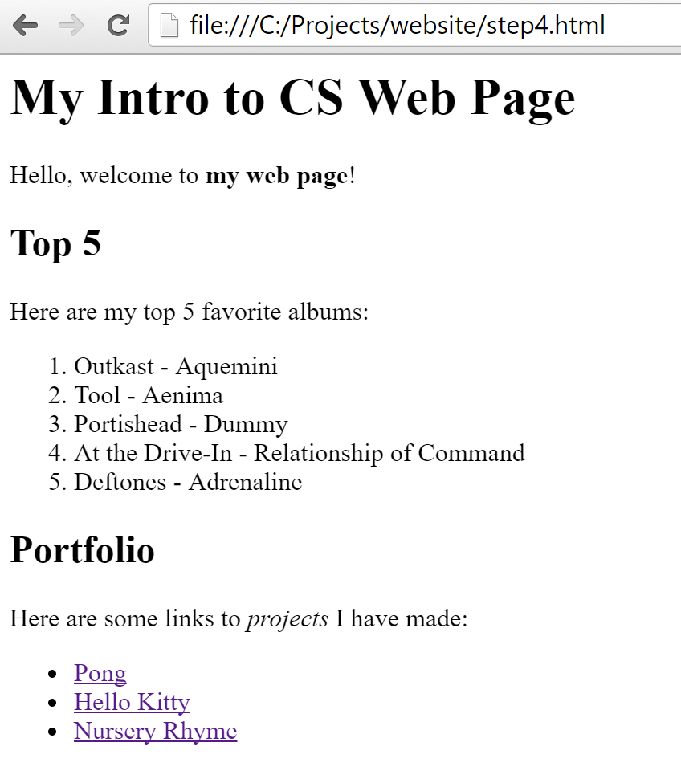

<a name="step5" />

## Step 5: Publishing Your Web Page

You can write all of the HTML markup on your computer locally and view the HTML file in your web browser. However, the beauty of a web page is that it is published on the Internet where people all over the world can see it.

In order for other people to see you webpage, it needs to be uploaded to a web server. This can be done by using FTP (File Transfer Protocol) or by using a web or graphical interface that simplifies this process. For the purposes of this lesson, we will use Github.

### What is Github?

Github.com is a web-based code hosting service. It is the place where most developers around the world collaborate on coding projects. This lesson plan that you are reading is hosted on Github.

### Creating a Github Account

### Publishing Your Page on Github

yourusername.github.io

After you log in, click the button to create a new repository.

My username is larryteacher, so I am creating a respository named larryteacher.github.io

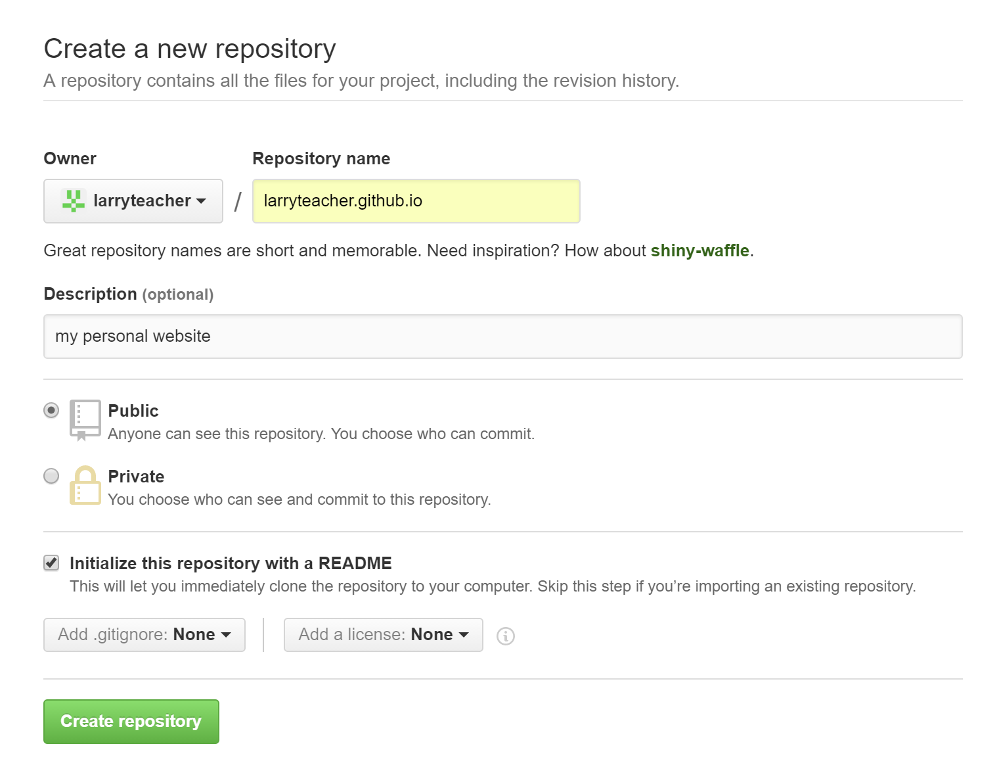

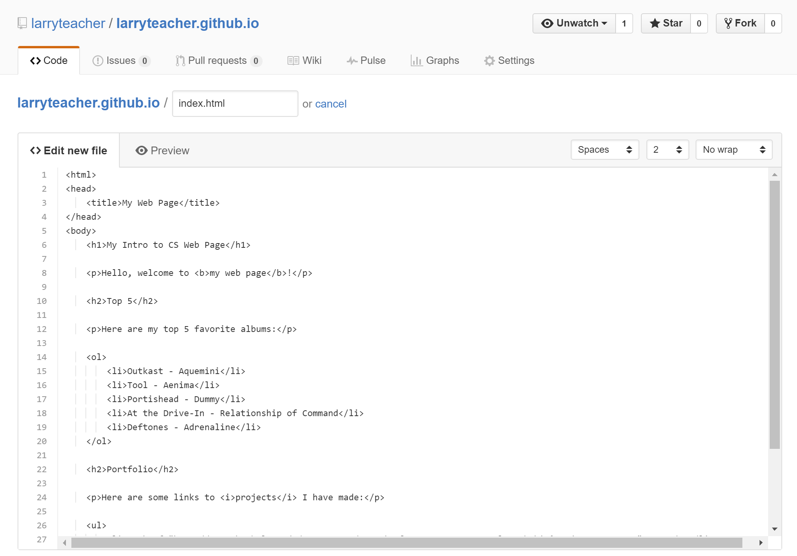

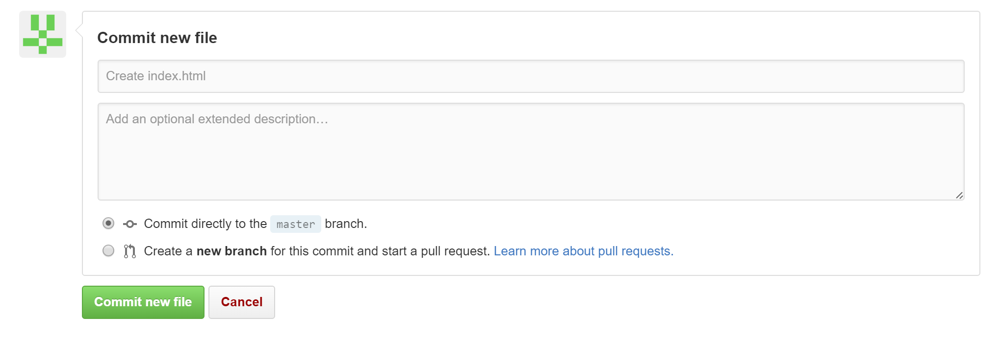

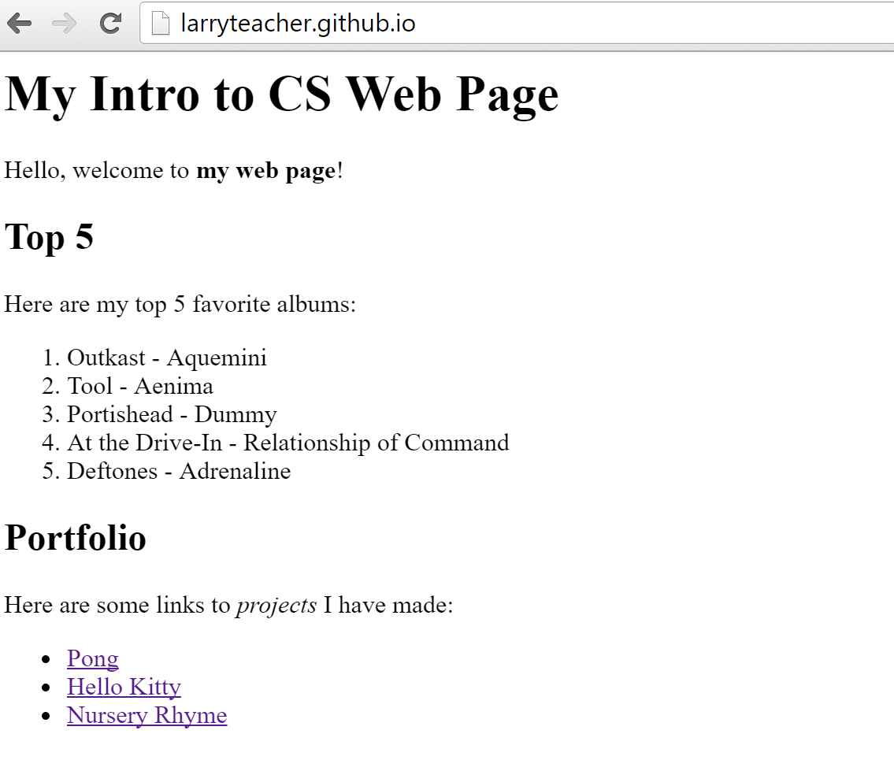

### Getting Your Own Domain Name

### Publishing Our Class Website

We are going to link all of the websites together

westseattle.github.io

<a name="goingfurther" />

## Going Further with HTML

We covered how to create and publish a basic web page, but there is much more to HTML and web development than what is written here. Most web pages you see have images, videos, a variety of colors and fonts, tables, forms, and various scripts to make the page more dynamic and rich. Below are some additional elements you can add to your web page to improve upon it. If you improve your web development skills over time, you can do powerful things. You can create a web page for a local business, use it as a creative outlet, or create a useful web application that is used by people around the world.

<a name="images" />

## Images with the `````` tag

Get a favorite photo or two from the internet or one you took on your phone. You can upload your photos online to a site like <a href="http://imgur.com">Imgur</a>, then display them in your web page. For instance, here is a photo of my dog that I uploaded to Imgur. I copied the URL to the photo to my clipboard, then used the `````` tag to show it in this web page.

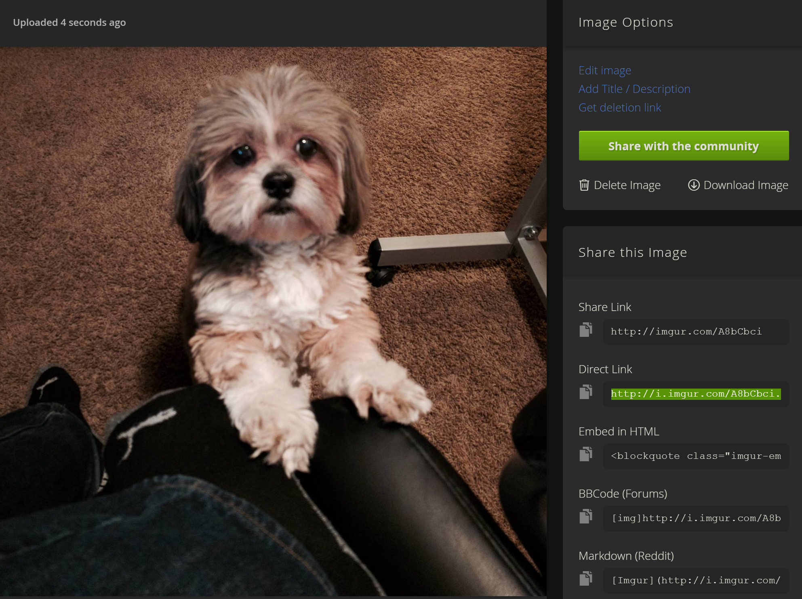

### Markup

```

```

### Output


<a name="videos" />

## Videos

Videos can be added to a webpage by embedding them. Go to YouTube and find a video you like. Click share and copy the embed code under the video.

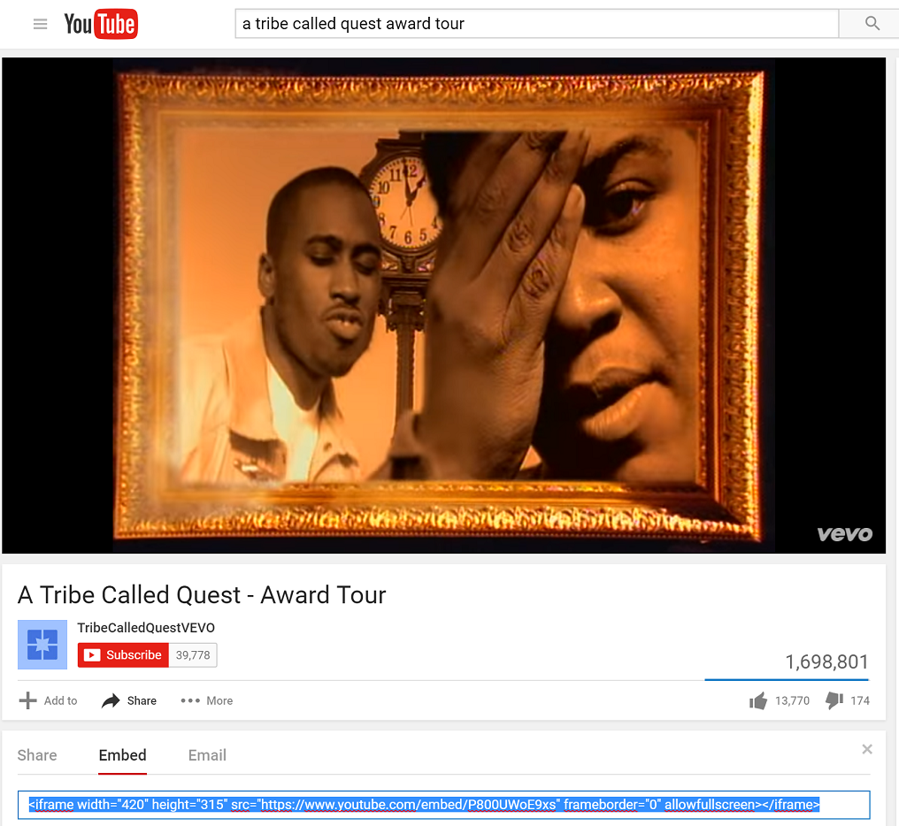

Here is the HTML markup for displaying a list of 5 music videos I like:

```
<h2>5 Music Videos by A Tribe Called Quest</h2>

<h3>Award Tour</h3>

<iframe width="420" height="315" src="https://www.youtube.com/embed/P800UWoE9xs" frameborder="0" allowfullscreen></iframe>

<h3>Check the Rhime</h3>

<iframe width="420" height="315" src="https://www.youtube.com/embed/O3pyCGnZzYA" frameborder="0" allowfullscreen></iframe>

<h3>Can I Kick It?</h3>

<iframe width="420" height="315" src="https://www.youtube.com/embed/O3pyCGnZzYA" frameborder="0" allowfullscreen></iframe>

<h3>Electric Relaxation</h3>

<iframe width="420" height="315" src="https://www.youtube.com/embed/WHRnvjCkTsw" frameborder="0" allowfullscreen></iframe>

<h3>Scenario</h3>

<iframe width="420" height="315" src="https://www.youtube.com/embed/Q6TLWqn82J4" frameborder="0" allowfullscreen></iframe>
```

<a name="quotations" />

## Quotation

A personal web page might have a list of your favorite quotes. Here is how you would include a quote from Tolkien:

### Markup

```
<blockquote>
"All that is gold does not glitter,
Not all those who wander are lost." - Tolkien
</blockquote>
```

### Output

<blockquote>
"All that is gold does not glitter,
Not all those who wander are lost". - Tolkien
</blockquote>

<a name="tables" />

## Tables

Data on a web page can be formatted as a table by using the ```<table>``` tag. In an HTML table, you use the ```<tr>``` tag to create a new table row. You use the ```<th>``` tag for table headings and the ```<td>``` tag for table data. Here is how you would include your class schedule on your website:

### Markup

```
<table>
    <tr>
        <th>Period</th>
        <th>Class</th>
        <th>Time</th>
    </tr>
    <tr>
        <td>1st Period</td>
        <td>Intro to CS</td>
        <td>7:50AM - 8:50AM</td>
    </tr>
    <tr>
        <td>2nd Period</td>
        <td>Intro to CS</td>
        <td>8:55AM - 9:50AM</td>
    </tr>
</table>
```

### Output

<table>
    <tr>
        <th>Period</th>
        <th>Class</th>
        <th>Time</th>
    </tr>
    <tr>
        <td>1st Period</td>
        <td>Intro to CS</td>
        <td>7:50AM - 8:50AM</td>
    </tr>
    <tr>
        <td>2nd Period</td>
        <td>Intro to CS</td>
        <td>8:55AM - 9:50AM</td>
    </tr>
</table>

<a name="styles" />

## Stylesheets and Divs

```
<link type="text/css" rel="stylesheet" href="style.css"></link>
```

```
body { background: black; color: white; font-family: arial; }
p { font-size: 18px; }
img { padding: 20px; border: solid gray 1px; }
```
<a name="forms" />

## Forms

### Creating a Form

#### Markup
```
<form>
    <label>Type in your name</label>
    <input id="name" name="name" type="text" />
    <input type="button" onclick="submit()" />
</form>
```

#### Output

<a name="javascript" />

### Processing the Form with JavaScript

#### JavaScript
```
<script type="text/javascript">
function submit() {
    document.getElementById('name');
    alert('hi ' + name.value);
}
</script>
```

#### What it does
